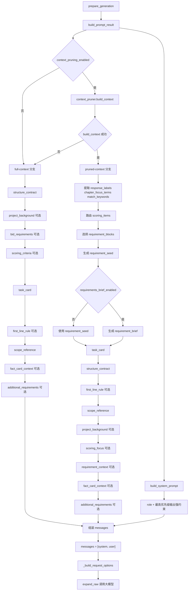

# Prompt Contract

## 1. 文档目的

本文只覆盖四件事：

1. system 角色提示词如何生成
2. 项目采购需求与评分标准如何被提炼为章节级上下文
3. user 提示词如何按固定顺序拼接
4. 最终实际发送给大模型的内容长什么样

说明：

- 本文描述的是代码里的“真实解析结果”和 prompt 装配合同，不强行等同于某一版 YAML 表面字段
- 从 2026-04 起，推荐 YAML schema 已切到 `project / writing / processing / models / runtime`
- 旧 `prompt.*`、`context_pruning.*`、`generation_trace.*` 等字段仍兼容；`Config` 会先把它们解析成当前代码使用的逻辑参数，再进入本文描述的 prompt 链路

本文不讨论以下内容：

- GUI 交互
- trace 展示层的维护者摘要视图
- 生成完成后的正文后处理细节

与本文直接相关的代码入口有三个：

- `bid_writer/ai_writer.py`
- `bid_writer/context_pruner.py`
- `bid_writer/config.py`

## 2. 真实调用链

当前章节生成请求的 prompt 链路固定如下：

1. `AIWriter.prepare_generation(heading, additional_requirements, target_words, stream, max_mermaid_flowcharts_per_section_override)`
2. `AIWriter.build_prompt_result(...)`
3. 如果 `context_pruning_enabled=True`，则在 `build_prompt_result()` 内调用 `ChapterContextPruner.build_context(heading)`
4. `AIWriter.build_system_prompt()`
5. 组装 `messages = [{"role": "system", ...}, {"role": "user", ...}]`
6. `_build_request_options(messages, stream)` 生成模型请求参数
7. `expand_raw()` 调用大模型

这意味着，真正进入大模型的提示词只有两段：

- 一段 `system prompt`
- 一段 `user prompt`

没有第三段隐藏的 requirements prompt，也没有单独的 scoring prompt。

并且从当前实现开始：

- `system prompt` 只由角色设定和固定门禁文件组成
- `user prompt` 不再重复整段展开全局结构硬要求
- trace / 合同里的 `structure_rules` block 仍保留，但其运行时含义已变为“短执行提醒 + task 侧额外规则”

## 3. System Prompt

### 3.1 组成来源

`system prompt` 由 `AIWriter.build_system_prompt()` 生成，来源只有两块：

1. `Config.role`
2. 固定门禁文件 `roles/system_gate_rules.md`

### 3.2 `Config.role`

`Config.role` 是 system prompt 的第一段。如果配置里未设置，默认值是：

```text
你是一位专业的标书撰写专家。
```

### 3.3 高优先级强约束

`roles/system_gate_rules.md` 直接按原文读取，不再通过 YAML 字段拼接 gate 文案。

运行时只做两类替换/校验：

1. 如果 gate 文件中包含 `{bidder_name}`，会用 `project.bidder_name` 替换
2. 如果 gate 文件缺失、为空，或者文本中需要 `bidder_name` 但项目里没填，则直接 fail fast

因此，想修改 system gate 规则时，应直接改 `roles/system_gate_rules.md`，而不是改旧 YAML 兼容字段。

### 3.4 最终形态

最终 `system prompt` 的文本结构如下：

```text
{role}

【最高优先级输出强约束】
以下规则优先级高于其他风格建议、默认模板和惯常表达；如有冲突，必须以本节规则为准。
- ...
- ...
```

### 3.5 重要边界

以下内容当前不进入 `system prompt`：

- `bid_requirements`
- `scoring_criteria`
- `prompt_output_format`
- `prompt_first_line_template`
- `additional_requirements`
- `prompt_hard_constraints`

这些内容都在 `user prompt`。

## 4. 项目采购需求与评分标准提炼

### 4.1 入口开关

章节级提炼是否发生，先看 `context_pruning_enabled`。

- `False`：不做章节级提炼，直接走 full-context 分支
- `True`：尝试构建 `ChapterContext`

在 pruned 分支内部，又分两层模式：

- 总开关：`context_pruning.mode`
- 组件开关：
  - `context_pruning.scoring.mode`
  - `context_pruning.requirements.mode`

当前可用值：

- `legacy_rule`
- `hybrid_extract`

但需要明确一点：

- `hybrid_extract` 当前已经实现到两层：
  - lexical retrieval
  - 可选 vector retrieval
- 还支持可选的 `rerank/verify`
- 如果配置打开了某项能力，但运行所需连接参数未配置，代码会按 `context_pruning.unavailable_policy` 决定：
  - `fallback_legacy`：回退到 `legacy_rule`
  - `fail_fast`：直接报错

需要特别注意：

- `build_prompt_result()` 里如果 `context_pruner.build_context(...)` 抛异常，会直接静默回退到 full-context 分支
- 也就是说，只要裁剪失败，大模型看到的就会变成完整大纲、完整采购需求、完整评分标准

补充：

- 从 2026-04 起，`additional_requirements` 默认只承载操作员手工输入，不再自动拼入“关联章节摘要”
- 这类摘要属于 GUI 层的注入结果，不会在 `build_prompt_result()` 内形成新的独立 block

补充：

- 当 `processing.path=auto`、`processing.project_background.enabled=true` 且 `processing.project_background.scope=h2_auto` 时，项目背景不再取全局摘要，而是通过 `H2ProjectBackgroundGenerator.get_for_heading()` 读取当前章节所属 H2 的背景缓存或按配置补生成
- H2 背景只作为章级项目情境进入 `project_background` section，不替代当前章节的 `评分关注` 和 `需求要点`
- `full_context` 已经把完整采购需求和评分标准放入 prompt，不再调用 `ProjectBackgroundGenerator.get_or_generate()`，也不会生成 `project_background` section

### 4.2 `ChapterContext` 是什么

`ChapterContext` 是章节级裁剪结果，包含：

- `response_labels`
- `chapter_focus_terms`
- `match_keywords`
- `scoring_items`
- `scoring_candidates`
- `requirement_seed`
- `requirement_blocks`
- `requirement_brief`
- `requirement_brief_status`
- `requirement_brief_error`

真正会影响 prompt 拼接的核心字段只有四类：

- `chapter_focus_terms`
- `scoring_items`
- `requirement_seed`
- `requirement_brief`

需要单独指出：

- `response_labels` 不直接单独成段，但会影响 `## 评分关注` 的引导语句

### 4.3 局部章节信号是怎么提取的

在 `ChapterContextPruner._build_signal_context()` 中，先构建章节自身的匹配信号：

1. `response_labels`
2. `chapter_focus_terms`
3. `match_keywords`

它们的来源分别是：

- `response_labels`
  - 从当前标题及祖先标题中，匹配 `响应:` 或 `对应评分标准:` 这类标记
  - 例如标题里有 `（响应：项目理解、质量保障）`，会被拆成多个 label
- `chapter_focus_terms`
  - 从当前章节标题本身抽取关键词变体
  - 会去掉常见通用后缀，例如“方案”“措施”“计划”等
- `match_keywords`
  - 把 `response_labels` 和整条标题链的关键词变体合并起来，作为统一匹配词集

### 4.4 评分标准提炼

评分标准的来源是 `Config.scoring_criteria`。

当前评分标准提炼有两条实现路径。

#### `legacy_rule`

`legacy_rule` 仍然是旧逻辑：

1. 从 `scoring_criteria` 中解析 Markdown 表格
2. 识别表头中的“子项/评分项/评审因素/项目/子项目”
3. 识别表头中的“评审标准/评分标准/评审内容/标准”
4. 可选识别“权重/分值/满分/分数”
5. 每一行转成一个 `ScoringCriterion(subitem, standard, weight)`
6. 通过 `_route_scoring_items()` 做关键词和焦点词匹配

这条链路的限制没有变：

- 它主要依赖 Markdown 表格
- 如果 `scoring_criteria` 是纯 Markdown 文字段落，`评分关注` 很可能命不中

#### `hybrid_extract`

`hybrid_extract` 是新增链路：

1. 先把 `scoring_criteria` 解析成统一 `SourceUnit`
2. `parse_mode=auto` 时，同时支持：
   - Markdown 表格行
   - Markdown 文字评分段
3. 先做 lexical retrieval
4. 如果 `context_pruning.retrieval.vector_enabled=True`，再做 vector retrieval
5. lexical / vector 结果通过 rank-based 融合
6. 如果开启 `rerank_enabled` 或 `llm_verify_enabled`，再对少量候选做可选校验
7. 选中的候选再映射回 `ScoringCriterion`

如果出现以下任一情况，user prompt 中就不会出现 `评分关注`：

- `context_pruning_scoring_enabled=False`
- `scoring_criteria` 为空
- 当前模式没有命中评分项

### 4.5 采购需求提炼

采购需求的来源是 `Config.bid_requirements`。

当前采购需求提炼也有两条实现路径。

#### `legacy_rule`

`legacy_rule` 仍然是旧逻辑：

1. 将 `bid_requirements` 按空行切块
2. 如果某个块看起来像标题块，会与下一块合并
3. 对每个块按以下信号打分
   - `response_labels`
   - `match_keywords`
   - `chapter_focus_terms`
4. 对明显偏题的通用噪音块做降权
5. 选出最相关的块

#### `hybrid_extract`

`hybrid_extract` 会：

1. 先把 `bid_requirements` 解析成统一 `SourceUnit`
2. 先做 lexical retrieval
3. 如果启用向量召回，再做 vector retrieval
4. 如果启用 verifier，再在少量候选中只选择 `unit_id`
5. 选中候选后，仍然只把原文块送入后续摘录逻辑

也就是说：

- 它不是摘要模型
- 它不是自由生成
- 它的改进点主要在“召回和路由”，不是“改写”

### 4.6 `requirement_seed` 和 `requirement_brief`

从已选中的采购需求块，会派生出两种不同层次的结果。

#### `requirement_seed`

`requirement_seed` 是“压缩后的需求要点”：

- 来自已选中需求块
- 对内容做简短归纳
- 最多 5 条
- 每条最长约 120 个字符
- 结果是 `- xxx` 形式的项目符号

它更像“提炼后的章节需求摘要”。

#### `requirement_brief`

`requirement_brief` 是“原文摘录”：

- 只在 `context_pruning_requirements_brief_enabled=True` 时生成
- 不是辅助模型摘要
- 不是对 `requirement_seed` 的改写
- 它直接从已选中需求块中截取原文句子
- 每个块最多取前 2 句
- 最多保留 `context_pruning.requirements.max_quotes` 条
- 单条最大长度受 `context_pruning.requirements.max_quote_chars` 控制

因此当前实现里：

- `requirement_seed` 是概括版
- `requirement_brief` 是摘录版

### 4.7 一个容易混淆但很关键的事实

内部字段名虽然叫 `requirement_brief`，但它进入最终 `user prompt` 时，标题仍然写成：

```text
## 需求要点
```

原因不是它真的变成了“摘要”，而是为了和任务卡里的“写作依据：优先根据下方评分关注和需求要点组织内容”保持一致。

也就是说：

- 内部数据语义：`requirement_brief = 原文摘录`
- 外部 prompt 展示标题：`需求要点`

### 4.8 哪个需求段会进入 user prompt

pruned 分支里，需求相关内容只会出现一个区块：

1. 如果 `requirement_brief` 非空，优先使用它
2. 否则如果 `requirement_seed` 非空，使用它
3. 两者都空，则不拼需求区块

不存在同时把 `requirement_brief` 和 `requirement_seed` 一起塞进 prompt 的情况。

## 5. User Prompt 拼接规则

### 5.1 拼接顺序

`AIWriter.build_prompt_result()` 会按分支拼接 `user prompt`：

#### pruned-context 分支

1. `task_card`
2. `structure_contract`
3. 可选 `first_line_rule`
4. `scope_reference`
5. 可选 `project_background`
6. 可选 `scoring_focus`
7. 可选 `requirement_brief` / `requirement_points`
8. 若存在可用事实卡片，则注入 `fact_card_context`
9. 可选 `additional_requirements`

#### full-context 分支

1. `structure_contract`
2. 可选 `bid_requirements`
3. 可选 `scoring_criteria`
4. `task_card`
5. 可选 `first_line_rule`
6. `scope_reference`
7. 若存在可用事实卡片，则注入 `fact_card_context`
8. 可选 `additional_requirements`

`additional_requirements` 当前只承载操作员手工输入的附加要求。

上述顺序是硬编码的，没有配置化。

### 5.2 低层 section 一览

| Section id | 最终标题 | 何时出现 | 说明 |
|------------|----------|----------|------|
| `task_card` | `## 章节任务卡` | 总是出现 | 定义当前章节写作任务 |
| `structure_contract` | 无独立标题；直接输出短提醒列表 | 总是出现 | 提醒“严格遵守 system 硬门禁”并补充 task 侧简短执行规则 |
| `first_line_rule` | `## 首行要求` | `prompt_first_line_template` 非空时 | 要求首行固定输出 |
| `scope_reference` | `## 章节边界参考` | 总是出现 | 给出父标题/当前标题/同级标题 |
| `project_background` | `## 项目背景` | pruned/auto 分支中项目背景摘要非空时 | auto + `scope=h2_auto` 使用当前 H2 背景；full-context 不生成该 section |
| `fact_card_context` | `## 事实卡片参考` | 启用事实卡片模式且当前章节存在可用事实卡片时 | 注入默认勾选且未被本章排除的全局卡片，以及当前章节选中的局部卡片，按 `enforcement=strong/reference` 分组；full-context 分支中位于章节任务卡和章节边界之后；渲染时会去除“本章节”等来源章节元话语 |
| `scoring_focus` | `## 评分关注` | pruned 分支且存在命中评分项时 | 只放命中的评分项 |
| `requirement_brief` | `## 需求要点` | pruned 分支且 `requirement_brief` 非空时 | 实际内容是原文摘录 |
| `requirement_points` | `## 需求要点` | pruned 分支且无 `requirement_brief`、但有 `requirement_seed` 时 | 实际内容是提炼后的要点 |
| `bid_requirements` | `## 招标需求参考` | full 分支且有采购需求原文时 | 放完整采购需求 |
| `scoring_criteria` | `## 评分标准参考` | full 分支且有评分标准原文时 | 放完整评分标准 |
| `additional_requirements` | `## 用户附加要求` | 最终附加要求非空时 | 运营侧临时补充要求 |

### 5.3 `task_card` 具体写了什么

`task_card` 当前固定包含以下字段（不再重复承载“默认使用正式层级序号组织正文”的全局硬门禁提醒）：

- 写作场景
- 当前章节路径
- 本章重点
- 可选的章节写作计划
- 篇幅目标区间
- 输出方式
- 表格控制
- 可选的流程图控制
- 写作依据

其中几个字段的真实来源要特别注意：

- “当前章节路径”直接使用 `HeadingNode.full_path`
- “本章重点”来自 `pruned_context.chapter_focus_terms`，如果没有 pruned context，则退回标题自身
- 当 `processing.full_context.chapter_writing_plan.enabled=true` 且当前走 full-context 分支时，会额外生成“章节写作计划”，并直接插入任务卡
- “输出方式”只引用 `prompt_output_format` 这段配置文本
- “表格控制”来自 `prompt_max_tables_per_section`
- “流程图控制”只在 `prompt_max_mermaid_flowcharts_per_section > 0` 或运行时 override 值 `> 0` 时出现
- 该约束只要求使用 Mermaid 代码块，不再把图类型固定为 `flowchart TD`
- 在 pruned 分支中，“写作依据”固定写成“优先根据下方评分关注和需求要点组织内容”
- 在 full-context 分支中，“写作依据”会改成引用前文固定参考材料，避免在稳定前缀前置后出现“下方”指代错位

### 5.4 `structure_contract` 具体写了什么

`structure_contract` 不再是对全局门禁的重复展开，而是在 user prompt 中承担短执行提醒的 section。当前固定包括：

```text
请严格遵守 system 中全部硬门禁，直接输出当前章节投标正文。

- 请优先围绕当前章节任务卡、上下文材料和章节边界展开，不要偏题，不要与同级章节重复。
- 在满足完整响应前提下，优先提高针对性、可执行性和评审可读性，不为凑篇幅重复展开。
```

此外：

- `prompt_extra_rules` 中的每一条规则会继续作为列表项追加在这两条提醒之后
- 因此当前 `structure_contract` / trace 中的 `structure_rules` block，职责已经变成“短执行提醒 + task 侧额外规则”
- 正式层级序号、禁 Markdown 标题等全局硬门禁，其权威规则源现在集中在 `system prompt`
- `user prompt` 仍会保留少量任务侧提醒文本；例如 `structure_contract` 的两条短提醒，以及 `task_card` 中的篇幅目标、表格控制、写作依据等任务信息
- 现在这些全局硬门禁文本来自 `Config.role` 与 `roles/system_gate_rules.md`，不是来自 `prompt.*` 兼容字段

### 5.5 `first_line_rule`

当 `prompt_first_line_template` 非空时，会额外插入：

```text
## 首行要求
- 首行固定输出：{格式化后的首行}
- 除首行外，不要再次重复当前标题。
```

模板支持：

- `{title}`
- `{full_path}`

### 5.6 pruned-context 分支

当 `pruned_context` 成功构建后，user prompt 会追加以下内容：

1. 公共段落中的 `## 章节边界参考`
2. 如果存在项目背景摘要，则追加 `## 项目背景`；auto + `scope=h2_auto` 时该摘要来自当前章节所属 H2
3. 如果命中评分项，则追加 `## 评分关注`
4. 如果 `requirement_brief` 非空，则追加 `## 需求要点`
5. 否则如果 `requirement_seed` 非空，则追加 `## 需求要点`

这条分支不会把完整 `bid_requirements` 和完整 `scoring_criteria` 直接放进 user prompt。

### 5.7 full-context 分支

以下情况会进入 full-context 分支：

- `context_pruning_enabled=False`
- `context_pruner.build_context(...)` 抛异常

在 full-context 分支中，会先构建一组稳定前缀段落：

1. `structure_contract`（无 `## 结构输出硬要求` 标题，仅为短提醒列表）
2. `## 项目背景`，仅在全局项目背景摘要存在时出现
3. `## 招标需求参考`
4. `## 评分标准参考`

对应原文非空时，该 section 才会真正出现。之后再进入章节动态段落，例如 `task_card`、`first_line_rule`、`scope_reference`。

`scope_reference` 不会进入稳定前缀，因为它包含当前章节和同级标题信息；如果把它放在最前面，会让不同 h3/h4 请求在很早的位置就分叉，削弱跨章节 prompt cache 复用。

若开启 `processing.full_context.chapter_writing_plan.enabled`，还会额外发生一次“章节写作计划”请求：

1. 该请求与正文扩写请求使用同一份 `system prompt`
2. 该请求的 `user prompt` 会先复用上述稳定前缀段落，再追加 `scope_reference` 与“只输出章节写作计划”的任务后缀
3. 正文扩写请求也会以前述稳定前缀作为 `user prompt` 前缀，然后再接 `task_card`
4. 生成出的“章节写作计划”最终仍写回 `task_card`

这样做的目的，是让“章节写作计划”请求与正文扩写请求尽可能共享相同的稳定前缀 token，同时不丢失章节边界信息，以便更容易命中模型侧 prompt cache。

也就是说，full 分支不再注入完整大纲，而是依赖轻量的章节边界信息，再配合完整采购需求和评分标准原文；其中真正稳定的 full-context 参考信息会被刻意放到 prompt 前缀以服务缓存复用。

### 5.8 拼接方式

每个 section 都通过 `_append_prompt_section()` 追加到 `prompt_parts`，最后执行：

```python
prompt = "\n".join(prompt_parts)
```

这意味着：

- section 顺序完全保留
- 中间不会做二次重排
- 中间不会做跨 section 去重
- 最终 `user prompt` 就是这些 section 文本按顺序直接拼起来

## 6. 最终发给大模型的内容

### 6.1 `messages` 结构

`prepare_generation()` 里最终组装的 `messages` 固定为：

```python
messages = [
    {"role": "system", "content": system_prompt},
    {"role": "user", "content": user_prompt},
]
```

因此，对大模型来说，真实输入就是：

- `system_prompt = build_system_prompt()`
- `user_prompt = build_prompt_result(...).prompt`

### 6.2 pruned 分支下的大致形态

```text
[system]
{role}

【最高优先级输出强约束】
- ...
- ...

[user]
## 章节任务卡
...

请严格遵守 system 中全部硬门禁，直接输出当前章节投标正文。

- 请优先围绕当前章节任务卡、上下文材料和章节边界展开，不要偏题，不要与同级章节重复。
- 在满足完整响应前提下，优先提高针对性、可执行性和评审可读性，不为凑篇幅重复展开。

## 首行要求
...

## 章节边界参考
...

## 评分关注
...

## 需求要点
...

## 用户附加要求
...
...
```

其中：

- `首行要求` 可能没有
- `评分关注` 可能没有
- `需求要点` 可能来自 `requirement_brief`，也可能来自 `requirement_seed`
- `用户附加要求` 也可能没有

### 6.3 full 分支下的大致形态

```text
[system]
{role}

【最高优先级输出强约束】
- ...
- ...

[user]
请严格遵守 system 中全部硬门禁，直接输出当前章节投标正文。

- 请优先围绕当前章节任务卡、上下文材料和章节边界展开，不要偏题，不要与同级章节重复。
- 在满足完整响应前提下，优先提高针对性、可执行性和评审可读性，不为凑篇幅重复展开。

## 项目背景
...

## 招标需求参考
...

## 评分标准参考
...

## 章节任务卡
...

## 首行要求
...

## 章节边界参考
...

## 用户附加要求
...
...
```

其中：

- `首行要求` 可能没有
- `项目背景` 可能没有
- `招标需求参考` 和 `评分标准参考` 取决于对应原文是否为空
- `用户附加要求` 也可能没有

### 6.4 除 prompt 外还会传什么

模型请求参数由 `_build_request_options()` 生成，包含：

- `model`
- `messages`
- `temperature`
- `max_tokens`
- `stream`
- 可选 `top_p`
- 可选 `seed`

这些参数会影响采样行为，但不改变 prompt 文本内容。

## 7. 调 prompt 时必须区分的变量

### 7.1 直接影响模型输入的变量

| 变量名 | 来源 | 含义 | 是否直接进入模型输入 |
|--------|------|------|----------------------|
| `role` | `Config.role` | system prompt 的角色设定 | 是 |
| `bid_requirements` | `Config.bid_requirements` | 项目采购需求原文 | 是，直接或间接 |
| `scoring_criteria` | `Config.scoring_criteria` | 评分标准原文 | 是，直接或间接 |
| `context_pruning_enabled` | `context_pruning.enabled` | 是否走章节级裁剪 | 是，决定分支 |
| `context_pruning_mode` | `context_pruning.mode` | 章节裁剪主模式 | 间接进入，决定路由 |
| `context_pruning_unavailable_policy` | `context_pruning.unavailable_policy` | 新模式不可用时回退还是报错 | 间接进入，决定路由 |
| `context_pruning_scoring_enabled` | `context_pruning.scoring.enabled` | 是否启用评分项路由 | 是 |
| `context_pruning_scoring_mode` | `context_pruning.scoring.mode` | 评分标准提炼模式 | 间接进入，决定路由 |
| `context_pruning_scoring_parse_mode` | `context_pruning.scoring.parse_mode` | 评分标准按表格/文字如何解析 | 间接进入，决定路由 |
| `context_pruning_scoring_max_rows` | `context_pruning.scoring.max_rows` | 最多保留几条评分项 | 是 |
| `context_pruning_requirements_mode` | `context_pruning.requirements.mode` | 采购需求提炼模式 | 间接进入，决定路由 |
| `context_pruning_requirements_max_quotes` | `context_pruning.requirements.max_quotes` | 最多保留几条需求摘录 | 是，影响 `requirement_brief` |
| `context_pruning_requirements_max_quote_chars` | `context_pruning.requirements.max_quote_chars` | 单条需求摘录最长字符数 | 是，影响 `requirement_brief` |
| `context_pruning_requirements_brief_enabled` | `context_pruning.requirements_brief.enabled` | 是否生成原文摘录版需求内容 | 是 |
| `context_pruning_retrieval_lexical_enabled` | `context_pruning.retrieval.lexical_enabled` | 是否启用 lexical retrieval | 间接进入，决定路由 |
| `context_pruning_retrieval_vector_enabled` | `context_pruning.retrieval.vector_enabled` | 是否启用向量召回 | 间接进入，决定路由 |
| `context_pruning_retrieval_rerank_enabled` | `context_pruning.retrieval.rerank_enabled` | 是否启用二次精排 | 间接进入，决定路由 |
| `context_pruning_extraction_llm_verify_enabled` | `context_pruning.extraction.llm_verify_enabled` | 是否启用候选校验 | 间接进入，决定路由 |
| `embedding_api_base_url` | `.env.local` / 环境变量 `BID_WRITER_EMBEDDING_API_BASE_URL` | embedding 服务根地址 | 间接进入，影响 vector retrieval |
| `embedding_api_key` | `.env.local` / 环境变量 `BID_WRITER_EMBEDDING_API_KEY` | embedding 服务密钥 | 间接进入，影响 vector retrieval |
| `embedding_model` | `.env.local` / 环境变量 `BID_WRITER_EMBEDDING_MODEL` | 向量模型名称 | 间接进入，决定 vector retrieval |
| `prompt_bidder_name` | `prompt.bidder_name` | 投标主体名称 | 是 |
| `prompt_output_format` | `prompt.output_format` | task card 中的输出方式描述 | 是 |
| `prompt_first_line_template` | `prompt.first_line_template` | 是否追加首行要求，以及首行文本 | 是 |
| `prompt_max_tables_per_section` | `prompt.max_tables_per_section` | task card 中的表格控制文案 | 是 |
| `prompt_max_mermaid_flowcharts_per_section` | `prompt.max_mermaid_flowcharts_per_section` | task card 中的流程图控制文案 | 条件性进入 |
| `prompt_hard_constraints` | `prompt.hard_constraints` | 兼容旧字段，当前不再作为 system prompt 附加强约束来源 | 否 |
| `prompt_extra_rules` | `prompt.extra_rules` | 追加到 `structure_contract` 末尾的补充规则 | 是 |
| `additional_requirements` | 运行时入参 | 操作员临时补充的要求 | 是 |
| `fact_card_mode` | GUI 运行时入参 | 控制是否启用事实卡片模式 | 是 |
| `fact_cards.chapter_defaults.*.should_reference` | 配置 YAML | 章节级事实卡片引用状态；为 `false` 时该章节不注入事实卡片 | 间接进入 |
| `selected_fact_cards` | GUI 运行时入参 / `FactCardStore.resolve_chapter_prompt_cards()` | 解析后的事实卡片，携带卡片本体的 `scope` 与 `enforcement` | 条件性进入 |
| `target_words` | 运行时入参 | 目标篇幅基准值；会进一步推导成区间文案 | 是 |
| `max_mermaid_flowcharts_per_section_override` | GUI 运行时入参 | 覆盖配置中的 Mermaid 图示上限；`0` 时不注入流程图控制提示 | 条件性进入 |
| `HeadingNode.title` | 当前章节节点 | 当前章节标题 | 是 |
| `HeadingNode.full_path` | 当前章节节点 | 当前章节完整路径 | 是 |
| `response_labels` | 标题链解析结果 | 用于路由评分项和需求块 | 间接进入 |
| `chapter_focus_terms` | 当前标题提词结果 | task card 的本章重点，也参与路由 | 间接进入 |
| `match_keywords` | 标签与标题链关键词 | 用于匹配评分项和需求块 | 间接进入 |
| `scoring_items` | 评分路由结果 | pruned 分支中的 `评分关注` | 是 |
| `requirement_seed` | 需求提炼结果 | 作为备用 `需求要点` 内容 | 是 |
| `requirement_brief` | 需求摘录结果 | 优先作为 `需求要点` 内容 | 是 |
| `pruning_api_base_url` | `.env.local` / 环境变量 `BID_WRITER_PRUNING_API_BASE_URL` | 候选校验辅助模型地址 | 间接进入，影响 verifier |
| `pruning_api_key` | `.env.local` / 环境变量 `BID_WRITER_PRUNING_API_KEY` | 候选校验辅助模型密钥 | 间接进入，影响 verifier |
| `pruning_model` | `.env.local` / 环境变量 `BID_WRITER_PRUNING_MODEL` | 候选校验辅助模型名称 | 间接进入，影响 verifier |
| `pruning_temperature` | `.env.local` / 环境变量 `BID_WRITER_PRUNING_TEMPERATURE` | 候选校验辅助模型温度 | 间接进入，影响 verifier |
| `pruning_max_tokens` | `.env.local` / 环境变量 `BID_WRITER_PRUNING_MAX_TOKENS` | 候选校验辅助模型输出上限 | 间接进入，影响 verifier |
| `pruning_timeout_seconds` | `.env.local` / 环境变量 `BID_WRITER_PRUNING_TIMEOUT_SECONDS` | 候选校验辅助模型超时 | 间接进入，影响 verifier |
| `pruning_max_retries` | `.env.local` / 环境变量 `BID_WRITER_PRUNING_MAX_RETRIES` | 候选校验辅助模型重试次数 | 间接进入，影响 verifier |
| `pruning_top_p` | `.env.local` / 环境变量 `BID_WRITER_PRUNING_TOP_P` | 候选校验辅助模型采样 top_p | 间接进入，影响 verifier |
| `pruning_seed` | `.env.local` / 环境变量 `BID_WRITER_PRUNING_SEED` | 候选校验辅助模型随机种子 | 间接进入，影响 verifier |

### 7.2 当前容易误判为“生效”，但实际上不影响这条链路的变量

| 变量名 | 当前状态 | 说明 |
|--------|----------|------|
| `prompt.allow_markdown_headings` / `prompt.allow_english_terms` / `prompt.summary_title` | 已废弃 | 旧配置可被读取为普通 YAML，但编辑器规范化保存会丢弃，运行时不再使用 |
| `context_pruning_requirements_brief_fallback` | 当前未接入主流程 | 配置存在，但 `build_context()` / `build_prompt_result()` 没有使用它决定回退行为 |
| `prompt_contract_blocks` | trace 专用 | 只给维护者看，不发给大模型 |

## 8. 优化 prompt 时的几个直接结论

1. 如果要改“角色”，应改 `Config.role`；如果要改“绝对规则”，应改 `roles/system_gate_rules.md`
2. 如果要改“章节任务卡、结构要求、需求/评分上下文如何对模型说”，应改 `build_prompt_result()`
3. 如果要改“采购需求和评分标准怎么提炼成章节上下文”，应改 `context_pruner.py`
4. 如果要降低 prompt 长度，最有效的开关是 `context_pruning_enabled`
5. 如果要提升需求贴合度，优先关注 `requirement_brief` 与 `requirement_seed` 的选择逻辑
6. 如果要提升评分命中率，优先关注 `response_labels`、`match_keywords`、`_route_scoring_items()` 和 `hybrid_extract` 的分段质量
7. 如果要提升同义表达、弱关键词场景下的召回，优先关注 `vector_enabled`
8. 如果发现同一配置下有时是精简 prompt、有时突然变成长 prompt，优先排查是否发生了 pruned 分支异常回退

## 9. 执行流程图


