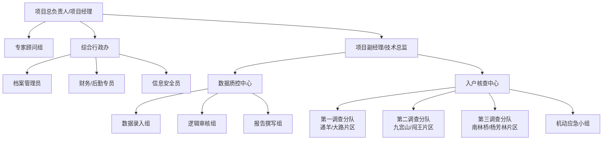

#### 2.1.1 项目组织架构图

一、 机构设置方案

1. 项目组织架构图及其运行机制详解

为确保通山县2025年度政府购买社会救助服务项目能够高效、精准、规范运作，我司依据《社会救助暂行办法》及通山县民政局关于核查工作的具体要求，结合我司多年从事民政基层服务的一线经验，特制定本项目的组织架构方案。

本方案遵循**“垂直管理、职能分离、网格作业、全程留痕”**的十六字原则，构建了一个以项目经理为核心，以前端调查与后端质控为两翼，以综合保障为基石的“金字塔式”稳健组织架构。

（1） 组织架构设计理念

在展示具体的架构图之前，须阐明本架构设计的四大核心逻辑，这也是确保项目履约成功的理论基础：

1.  **决策与执行分离（指挥层与执行层）：** 设立项目经理负责制，将宏观的统筹调度与微观的入户执行剥离。避免因一线调查员既当“裁判员”又当“运动员”，确保每一项入户指令都经过统一研判发出。
2.  **调查与审核分离（前台与后台）：** 这是社会救助核查工作的生命线。我们将团队明确划分为“入户调查组”（前台）和“数据质控组”（后台）。前台只负责如实采集“人、房、车、钱、业”客观数据，不负责判定是否符合低保条件；后台负责数据逻辑比对和政策匹配。这种物理上的职能隔离，能有效杜绝“人情保”、“关系保”的廉政风险。
3.  **属地化与网格化结合（区域划分）：** 考虑到通山县地处鄂南山区，乡镇分散、交通线长。我们在架构中引入“片区网格化”概念，将调查组按乡镇地理位置划分为若干机动分队，实现“定人、定车、定责、定区域”，提高响应速度，降低行政成本。
4.  **全流程闭环管理（质量控制）：** 在架构中设立独立的“督导质控岗”，不隶属于任何调查小组，直接向项目经理汇报。其职能贯穿于任务下发、入户核查、数据录入、档案归档的全过程，确保每一个环节都有质量监控节点。

（2） 项目组织架构图（示意）

为了直观展示我司为本项目搭建的团队结构，特绘制如下组织架构图：

（3） 核心岗位与部门职能详解

本架构共设置**“一室两中心”**（综合行政办、数据质控中心、入户核查中心），各部门职责边界清晰，协同运作。以下为详细职能界定：

① 项目总负责人（项目经理）
**【岗位定位】** 项目的“大脑”与“第一责任人”，必须常驻通山县。
**【核心职责】**
*   **统筹决策：** 负责项目整体服务方案的落地执行，对项目进度、质量、安全负总责。
*   **外部联络：** 作为与通山县民政局的唯一官方接口人，负责参加联席会议，汇报工作进度，接收并分解采购人下达的临时性、紧急性任务。
*   **疑难研判：** 主持每周的“个案会商会”，对入户调查中发现的“人户分离”、“隐形就业”、“大额支出”等疑难复杂个案进行最终研判。
*   **危机公关：** 处理服务过程中可能出现的突发事件（如群众投诉、调查员受伤、车辆事故等），启动应急预案。

② 专家顾问组（外聘/公司总部支持）
**【岗位定位】** 项目的“智囊团”，提供技术支持与理论指导。
**【核心职责】**

*   **政策解读：** 定期收集国家、湖北省及咸宁市关于社会救助的最新政策文件，编制《业务操作手册》。
*   **培训赋能：** 每季度赴通山县开展一次全员集中培训，重点讲解最新的收入核算口径（如赡养费计算、务工收入评估标准）。
*   **质量审计：** 每半年对项目档案进行一次飞行检查，模拟第三方审计视角，提前发现并整改问题。

 ③ 综合行政办
**【岗位定位】** 项目的“大管家”，保障团队高效运转。
**【下设岗位及职责】**
*   **档案管理员（关键岗位）：**
    *   严格按照《社会救助档案管理规范》，建立“一户一档”机制。
    *   负责纸质档案的回收、清点、分类、打码、装订与入库管理。
    *   管理电子档案库，确保电子数据与纸质资料的一致性。
    *   执行严格的借阅制度，确保档案不丢失、不泄密。
*   **财务/后勤专员：**
    *   负责项目资金的独立核算，管理备用金。
    *   负责调查员的车辆调度、油费报销审核及食宿安排。
    *   负责办公用品、调查装备（工牌、马甲、手电筒、驱狗棒等）的采购与分发。
*   **信息安全员：**
    *   负责办公网络的安全维护，监控内网数据传输。
    *   定期对所有工作电脑进行病毒查杀和日志审计。
    *   监督员工签署《保密协议》执行情况，定期开展保密教育。

④ 数据质控中心
**【岗位定位】** 项目的“过滤器”与“中央厨房”，确保数据精准无误。
**【核心职责】**
*   **数据录入组：**
    *   负责将前端采集回来的《入户调查表》、诚信承诺书、佐证照片等信息，准确录入至“湖北省社会救助信息管理系统”或采购人指定的数据库中。
    *   执行“双人盲录”机制（对关键数据，由两人分别录入一次，系统比对一致方可提交），确保录入错误率低于1‰。
*   **逻辑审核组：**
    *   **完整性审核：** 检查表格是否填写齐全，是否有空项、漏项，签字盖章是否完备。
    *   **逻辑性审核：** 利用逻辑公式校验数据的合理性。例如：检查“家庭收入”与“家庭支出”是否严重倒挂；检查“残疾等级”与“劳动能力”描述是否矛盾；检查“低保类型”与“家庭财产”是否冲突。
    *   **退单重查：** 对于逻辑存疑的个案，填写《补正/重查通知单》，退回入户核查中心进行二次核实。
*   **报告撰写组：**
    *   基于核查数据，撰写分户核查报告，明确给出“建议保留”、“建议新增”、“建议调标”或“建议停保”的初审意见及依据。
    *   按月撰写《月度项目分析报告》，利用图表分析通山县各乡镇的救助对象分布、致贫原因构成等大数据特征，为民政局决策提供参考。

⑤ 入户核查中心
**【岗位定位】** 项目的“手脚”与“侦察兵”，承担一线数据采集重任。
**【核心职责】**
*   **网格化分队设置：**
    *   **第一调查分队（城区/近郊）：** 重点负责通羊镇、大路乡等人口密集、情况复杂的区域。该分队配备经验最丰富的老员工，擅长处理复杂的就业隐查和车辆房产核对。
    *   **第二调查分队（深山/远郊）：** 负责九宫山镇、闯王镇等偏远山区。该分队配备驾驶技术娴熟、身体素质好的人员，车辆配置越野性能较好的车型，适应山路作业。
    *   **第三调查分队（流动/支援）：** 负责南林桥镇、杨芳林乡等区域，同时作为机动力量，随时支援其他任务繁重的片区。
*   **工作内容：**
    *   **实地走访：** 严格执行“两名工作人员入户”规定，佩戴工牌，表明身份。
    *   **立体取证：** 按照“看、问、查、核”四步法工作。
        *   *看：* 居住环境、家电家具、生活痕迹；
        *   *问：* 就业情况、健康状况、子女就学；
        *   *查：* 身份证、户口本、残疾证、病历本、水电费单据；
        *   *核：* 邻里访问，侧面了解申请人真实生活水平。
    *   **痕迹管理：** 利用移动终端（手机/平板）拍摄带有时间、地点水印的照片，包括：申请人合影、房屋全貌、客厅、卧室、厨房、公示栏等，确保证据链完整。

⑥ 机动应急小组
**【岗位定位】** 项目的“消防队”，应对突发状况。
**【核心职责】**
*   **急难个案响应：** 针对遭遇火灾、交通事故、重大疾病等突发变故申请“临时救助”的家庭，承诺在接单后2小时内出发，24小时内完成核查并反馈报告。
*   **信访复核：** 配合民政局处理群众信访举报案件，由项目经理带队进行高规格的复核调查，确保证据经得起推敲。
*   **突发事件处置：** 在发生自然灾害或公共卫生事件时，服从通山县民政局统一调度，协助开展排查摸底工作。

（4） 组织架构的运行保障机制

仅有静态的架构图是不够的，必须配合动态的运行机制，才能确保整个机器高效运转。

① 纵向指挥链：指令下达与执行机制
*   **层级负责制：** 实行“项目经理—部门主管—分队组长—一线员工”四级垂直管理。上级对下级的工作结果负责，下级无条件服从上级的工作调度。
*   **任务派单制：**
    1.  项目经理接收民政局任务清单。
    2.  数据质控中心将任务按乡镇拆分，生成《派工单》。
    3.  各调查分队队长领取《派工单》及路线图，分配给具体调查小组。
    4.  调查小组完成任务后，交回《派工单》及原始资料进行销号。
*   **日清日结制：** 每日下午17:00，各分队队长必须向项目经理汇报当日进度（已核查户数、未入户原因、特殊情况）；每日上午8:30，召开15分钟晨会，部署当日重点。

② 横向协同链：查审互动机制
*   **即时纠错：** 数据质控中心在审核过程中，一旦发现入户资料缺项（如缺少病历首页照片），通过钉钉/微信工作群直接@对应调查员，要求其在24小时内补正。
*   **双向反馈：** 调查员在入户中发现政策界定模糊的情况（如：子女虽有赡养能力但实际上未履行赡养义务），应及时反馈给技术总监，由技术总监组织研判后，统一回复口径，避免各分队执行标准不一。

③ 外部联动链：政社合作机制
*   **联络员制度：** 每个乡镇民政办指定一名公司调查员作为“定点联络员”，负责与乡镇民政干事日常沟通，协调入户路线、车辆停放及村（居）委会配合事宜。
*   **定期汇报制度：**
    *   **周报：** 每周五向民政局提交《周工作简报》，汇报本周核查数据统计。
    *   **月报：** 每月提交《月度分析报告》及下月计划。
    *   **专报：** 针对专项治理行动或典型案例，随时提交《专报》。

（5） 人员配置策略与本地化承诺

为支撑上述架构的有效运行，并响应招标文件中关于“常驻通山县”的要求，我司做出如下人员配置安排：

1.  **编制设定：** 本项目拟定岗编制 **12人**（含管理人员）。
    *   项目经理：1人（全职，常驻）
    *   技术总监/副经理：1人
    *   行政/财务/档案：1人
    *   数据质控/录入：3人
    *   入户调查员：6人（分为3个小组）
2.  **本地化招聘率：** 承诺项目团队中，**通山县本地户籍或在通山定居人员占比不低于85%**。
    *   *优势分析：* 本地人员熟悉通山方言（如通羊话、九宫山话），便于与留守老人沟通；熟悉地形路况，能提高入户效率；稳定性高，便于长期培养。
3.  **人员素质要求：**
    *   **项目经理：** 需具备3年以上社会救助或社会工作项目管理经验，持有“助理社会工作师”及以上职业资格证书。
    *   **调查员：** 优先录用大专以上学历人员、退伍军人或有村（居）委会工作经验者；必须具备良好的沟通能力、书面记录能力及保密意识；无犯罪记录，个人征信良好。
4.  **AB角替补机制：**
    *   所有关键岗位（如项目经理、档案员）均设置AB角。当A角因病、事假离岗时，B角能立即顶岗，确保工作不中断。
    *   建立由3-5人组成的“预备队”人才库，一旦正式员工离职，承诺在3个工作日内完成补员，7个工作日内完成培训上岗。

（6） 廉政与风险防控设计

本组织架构特别强化了自我监督功能，以防止权力寻租：

1.  **物理隔离：** 调查员只负责采集客观事实，无权决定救助金额；审核员只负责看数据和材料，不见面接触申请人。这种设计从源头上切断了“人情保”的操作空间。
2.  **轮岗制度：** 调查分队实行“半年轮岗制”。例如，第一分队上半年负责通羊镇，下半年轮换至九宫山镇。防止调查员与当地村干部或救助对象形成长期利益固化关系。
3.  **投诉直达：** 在入户调查时发放的《核查告知书》上，印制公司总部的监督投诉电话（非项目经理电话），直接接受群众对调查员违规行为的举报，由总部督察部直接处理。

**综上所述**，我司为通山县2025年度政府购买社会救助服务项目设计的组织架构，不是一张简单的图表，而是一套集**指挥、执行、监督、保障**于一体的精密管理系统。它充分考虑了社会救助工作的严肃性、通山县域环境的复杂性以及政府购买服务的合规性。

通过这一架构的实施，我们有信心实现：**入户调查100%覆盖，数据录入100%准确，档案管理100%规范，廉洁纪律100%遵守**，为通山县民政局打造一支“拉得出、冲得上、打得赢”的专业化社会救助核查铁军。