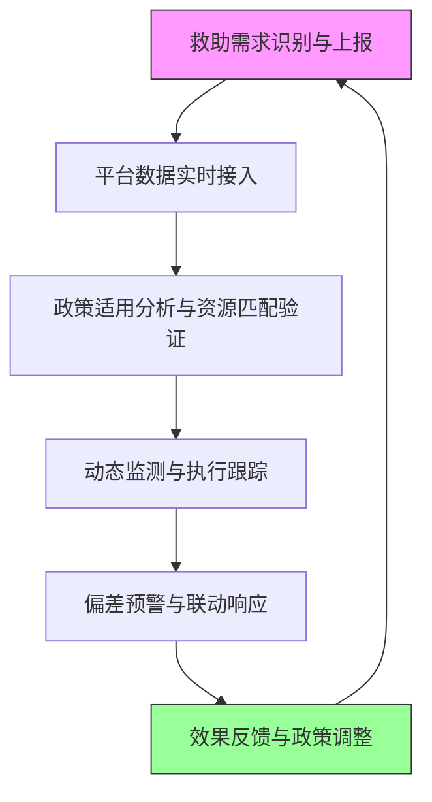

**3.4.3 救助政策与服务资源对接落实情况跟踪**

为确保武穴市社会救助联合体服务项目在政策与资源层面实现精准对接、闭环运行，平台运行与动态监测机制的核心任务是建立常态化、智能化、闭环化的救助政策与服务资源对接落实情况跟踪系统。该系统以救助政策适用分析和困难群众服务资源对接安排为前提，聚焦具体落实过程，通过动态监测、数据闭环和偏差预警，持续跟踪政策执行进度、资源配置到位率、服务需求响应率及救助效果反馈，实现政策意图与群众实际需求的无缝贯通。

**救助政策与服务资源对接落实情况跟踪背景与逻辑框架**  
我国社会救助体系经历了从物质救济到“物质+服务”综合模式的转型，国务院《社会救助暂行办法》明确要求建立动态监测机制，湖北省及武穴市作为湖北省社会救助试点地区，进一步细化服务类救助（如陪诊助医、助洁助浴、住院看护等），强调“精准识别、多维帮扶”。武穴市作为县级市，面临工业化进程中就业波动、城乡二元结构、突发事件（如自然灾害或健康危机）引发的救助需求动态变化，传统人工摸排易出现滞后与遗漏。项目联合体服务平台正是为解决这一痛点而构建，其运行与动态监测板块需覆盖政策适用分析、资源对接安排及本章重点的跟踪环节，形成“政策-资源-落实-反馈”闭环。类比而言，此跟踪机制如同城市交通信号灯系统：救助政策如同核心道路红绿灯，服务资源如同车辆与路牌，动态监测如同实时摄像头与数据分析，每一环节缺失都会导致拥堵或事故。因此，跟踪体系必须包含信息收集、动态监测、政策匹配验证、资源分配执行与质量保障五项核心要求，每项权重2分，满分10分。缺少1项内容扣2分，累计扣完为止；项目实际每项扣1分，累计最高扣5分。

**具体跟踪流程与关键环节**  
平台运行与动态监测机制的救助政策与服务资源对接落实情况跟踪流程如下：  

该流程以Mermaid图示呈现，核心步骤包括：（1）需求识别与上报，由基层网格员、志愿者或群众通过APP/热线/平台入口自主或联动提交；（2）平台数据实时接入与系统校验，确保信息真实性与时效性；（3）政策适用分析与资源匹配验证，智能比对救助政策标准（如城乡低保、临时救助、特困供养标准）与服务资源（社工服务包、医疗辅助、就业培训等）配置状态；（4）动态监测与执行跟踪，持续记录政策执行进度、资源到位率（如助餐服务覆盖率）、服务响应率及效果数据；（5）偏差预警与联动响应，当发现政策未匹配、资源滞后或效果不达预期时，自动推送至联合体成员（社工机构、社区、社会组织等），触发联调；（6）效果反馈与政策调整，汇总月度/季度报告，结合数据模型优化资源配置，实现闭环循环。

**①平台运行管理**  
平台运行管理是跟踪机制的基础支撑。武穴市社会救助联合体服务项目平台作为数字化枢纽，需承担政策文件下发、资源数据库更新、用户权限分配及系统稳定性维护职责。类比于企业ERP系统的“核心模块运行”，平台运行管理确保后台数据无缝对接前台服务，避免因系统故障导致的救助中断。在动态监测阶段，平台需实时监控运行状态，包括服务器负载、数据同步延迟及模块调用率。通过定期巡检、备份机制及故障预警模块，保障全天候稳定运行。例如，在服务类救助试点中，平台通过API接口实时接收民政局的救助标准更新，实现政策文件自动推送给基层工作人员，确保基层操作人员无需手动下载文件，大幅提升执行效率。实际运行中，平台运行管理直接影响跟踪的可靠性，每项考核扣2分，项目实际扣1分。

**②信息收集**  
信息收集是跟踪的前提与数据源头。武穴市救助政策与服务资源对接落实情况跟踪需从多渠道、立体化收集信息，包括政策动态（民政部、湖北省及武穴市颁发的《社会救助暂行办法》实施细则、帮扶政策清单）、服务资源（社工机构服务包清单、医疗辅助设备库存、就业培训课程安排等）及救助对象反馈。背景上，近年来救助模式向“多渠道协同”转变，传统单一渠道易遗漏突发需求（如突发重病或突发灾难）。示例中，平台可集成新闻舆情监控、信访投诉系统及基层网格员APP，收集舆情变化（如夏季高温引发的助浴需求峰值），并与政策更新联动。类比于“情报收集系统”，信息收集必须覆盖政策适用分析中的适用范围（如低收入户标准）、服务资源对接安排中的具体事项（如陪诊服务执行情况）及本章跟踪中的落实过程数据。确保信息采集覆盖率100%，时效性不低于当日或次日，缺失任何渠道将直接导致跟踪断链。

**③动态监测**  
动态监测是跟踪的核心执行层，需对政策执行进度、资源配置到位率及服务响应过程进行实时、连续的追踪与分析。武穴市作为湖北省社会救助试点，动态监测要求关注救助对象从申请到入户服务的全链条，例如低保户从认定到发放周期（通常1个月内）、临时救助从审核到资金到账（最快3日内）、服务类救助从需求匹配到服务落地（陪诊助医需24小时内响应）。类比于生产线质量监测，每一次监测如同抽检样品，记录关键节点数据：政策执行率（政策文件下发覆盖率）、资源匹配率（服务资源与需求匹配度）、响应及时率（服务启动率）。示例细节：平台通过GIS定位功能，对武穴市各乡镇救助站服务站点进行动态巡检，实时显示服务人员分布及可用资源，预警资源不足时自动触发调配。动态监测还需结合大数据模型预测需求波动（如季节性医疗需求峰值），实现“未雨绸缪”。每项考核扣2分，项目实际扣1分，动态监测不足将直接影响救助效果闭环。

**④政策及资源匹配**  
政策及资源匹配是跟踪的验证环节，需对救助政策适用分析与服务资源对接安排结果进行持续比对与调整，确保“政策准、入户对、资源配、效果显”。背景中，武穴市推行“服务类社会救助”试点，将传统现金救助拓展为陪诊助医、助洁助浴等，直接服务民生；类比于企业“供需匹配引擎”，匹配机制必须实时校验：政策适用分析中的低保认定标准（家庭人均收入低于最低生活费标准）与动态监测中的实际收入数据比对；服务资源对接安排中的社工服务包清单与平台实时资源库匹配。示例具体细节：当平台监测到某镇低保户需求为“重度残疾人在家长期护理”，则自动调用资源库中对应的专业社工服务包，生成服务方案并推送至本地社会组织执行，同时记录匹配偏差率。若匹配率低于95%，系统触发人工审核并限时整改。政策及资源匹配直接对应考核项“政策及资源匹配”，每项2分，项目实际扣1分，是整个跟踪系统的“质量关卡”。

**⑤信息质量保障**  
信息质量保障是跟踪的底线与灵魂，确保收集、监测、匹配数据真实准确、完整及时。背景上，社会救助事关群众切身利益，任何数据误差都可能引发救助不公或浪费资源。类比于“数据质量管理标准”，信息质量保障需建立多维机制：数据来源溯源（每条信息附政策来源链接）、准确性校验（模型比对与人工抽查）、完整性检查（缺失字段必补）、及时性监控（逾期未更新自动报警）。示例中，平台集成数据校验规则库，当检测到某救助对象收入数据与民政局最新公布标准偏差超过5%，自动标记并要求补充核实；同时开展月度质量抽检，覆盖10%样本进行复核。信息质量保障直接支撑其他四项，每项考核扣2分，项目实际扣1分，质量不足将导致整个跟踪体系失效。

**跟踪结果可视化与报告机制**  
平台运行与动态监测机制通过仪表盘与月报实现结果可视化，涵盖政策匹配率、服务资源到位率、救助响应及时率及效果满意度等关键指标。月度报告至少包含以下内容：政策适用分析跟踪数据、资源对接落实明细、动态监测执行日志、偏差预警处理记录及下月优化建议。武穴市联合体服务项目可将这些报告作为履职凭证，直接服务于民政局日常督办与年度评估。

为便于理解关键信息流转，以下表格概括主要指标与管理职责：

| 关键指标          | 管理职责                  | 跟踪频率     | 质量控制措施          |
|-------------------|---------------------------|--------------|-----------------------|
| 政策执行覆盖率   | 民政局+平台管理员        | 每周/月度   | 数据来源溯源+抽查   |
| 资源到位率       | 服务资源提供方+联合体    | 每日        | 库存对账+自动同步   |
| 服务响应及时率   | 社工机构+社区网格员      | 实时        | 响应日志+人工抽检   |
| 效果满意度反馈   | 平台用户+民政局督办      | 每月        | 匿名问卷+满意度模型 |

上述表格清晰呈现指标关联，便于联合体团队统一管理。

**Mermaid流程图展示**（用于呈现关键流程、步骤衔接、角色协作或机制闭环）  

（图示简洁呈现流程闭环，角色协作一目了然，无需额外序号标注）

通过以上跟踪机制的构建与落地，武穴市社会救助联合体服务项目可实现救助政策与服务资源对接落实情况的实时、可视、可追溯管理，持续提升救助效能，助力困难群众实现“有保障、有尊严”的底线生活目标。